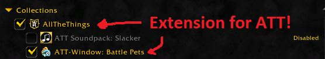

 

 

 

 

## Where do I find AllTheThings?
- [AllTheThings](https://github.com/ATTWoWAddon/AllTheThings)
Do you find yourself completing old content just so that you can get literally everything for your Collections? Say no more! ALL THE THINGS will help you with your endeavor by giving you the ability to track your completion for everything.

## Features
- Battle Pets, sorted alphabetically, in a convenient Standalone Window or Embeddable Dynamic Category (Classic Only).

## Release Schedule
New builds are created On Demand and will generally only include updated TOC versions. As the Battle Pet data itself is provided by AllTheThings, so long as ATT is up-to-date, this addon will also function as you expect and be up-to-date.

## Why do I need this addon?
- This addon filters ATT for all Battle Pets and arranges them alphabetically within each Battle Pet Type Category. You can open the window using /attpetbattles and either leave it open to have it restore or close it to open again at a later date! As with all other ATT Windows, it will recover back to its last known state on reload or relog!

## Problem? Suggestion?
Please visit our Discord or post an Issue on our Issue Tracker. Issues related to ATT itself should be posted to the AllTheThings Discord instead!

- [Discord](https://discord.gg/allthethings)
- [Issues](https://github.com/ATTWoWAddon/ATT-Window-Battle-Pets/issues)
- [FAQ](https://legacy.curseforge.com/wow/addons/all-the-things/pages/f-a-q)
- [WAGO.io](https://addons.wago.io/addons/att-window-battle-pets)

## Contributors
Thank you to the contributors for the work they do and the users who have submitted suggestions and bugs in Discord or on the forums! View and follow [our contributors here](https://github.com/ATTWoWAddon/ATT-Window-Battle-Pets/graphs/contributors)!

## Special Thanks
- DeadSerious -- Primary Artist for all Branding for ATT & Crieve's Twitch channel.

## Support Us
You can donate to our [Patreon here](https://www.patreon.com/allthethings)!
